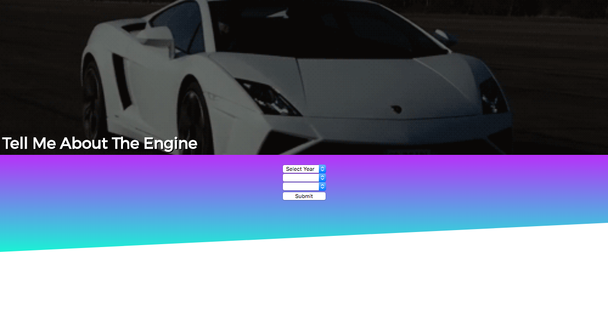

<h1>Tell Me About The Engine</h1>

<a href="#intro">Introduction</a> 
<a href="#about">About</a> 
<a href="#instructions">How To Use This Site</a>

<h2 id="intro">Introduction</h2> 
If you're like me, only two things matter when car shopping: how fast does it go and how nice does it look?  
<h2 id="about">About</h2>
So, in order to simplify that, I created an app that will give you the engine data and colors of every car in the Edmunds database from 1990 forward.  I have always been passionate about cars and hope if you are using this you share my passion.
I used the Edmund's API to gain access to a wealth of information.  I displayed it in bright colors because car shopping is the best time you can have and you should be having a blast doing it.  
<h2 id="instructions">How To Use This Site</h2>
You should start out at this screen with three drop down boxes.  The first box asks you to select a year.

